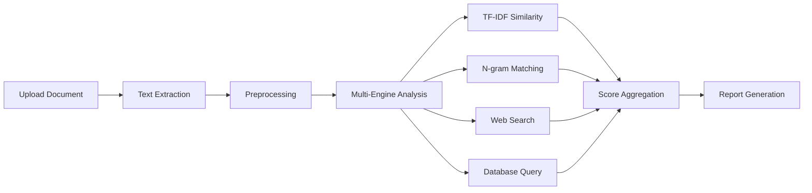

# 🔍 PlagiarismGuard Pro

<div align="center">


**Academic-Grade Plagiarism Detection • Free & Open Source • No Login Required**

[🚀 Live Demo](https://plagiarism-checker-web-app.vercel.app) • [📖 Documentation](#documentation) • [🤝 Contributing](#contributing)

</div>

---

## ✨ Features

### 🌍 Universal "Omni-Scanner" (Not Just Medical)
While developed by a medical professor, **PlagiarismGuard** works for **ALL** research fields:
- **⚖️ Law & Humanities** - Google Books, Open Library, JSTOR (via CrossRef)
- **🛠️ Engineering & CS** - IEEE Xplore, GitHub, StackOverflow, arXiv
- **🎨 Arts & Literature** - Internet Archive, Project Gutenberg, OpenAlex
- **🧬 Science & Medicine** - Europe PMC, PubMed, ScienceDirect

### 🧠 Cognitive AI (Phase 12 - NEW!)
Go beyond simple matching with **Google Gemini** integration:
- **🤖 AI Authorship Detection** - "Did ChatGPT write this?" (Confidence Score)
- **🧐 Intent Analysis** - Distinguishes "Sloppy Citation" from "Malicious Copying"
- **📝 Smart Summary** - Auto-generates 3-bullet executive summary

### 📄 Enterprise Reporting
- **Official PDF Certificates** - Unforgeable reports with "Verified" badge and simulated QR code
- **Detailed Evidence** - Full breakdown of every matched phrase and source URL
- **Word Export** - Classic .doc reports with color-coded highlights

### 🎯 Core Capabilities
- **Multi-Format Support** - Upload PDF, DOCX, TXT files or paste text directly
- **Drag & Drop Images** - Visual plagiarism detection using Perceptual Hashing (pHash)
- **Code Comparison** - Structure-aware analysis using Winnowing Algorithm
- **Real-Time Progress** - Live analysis with step-by-step feedback

### 🔓 Free & Open
- **No Registration Required** - Start checking immediately
- **No API Limits** - Unlimited checks for everyone
- **Open Source** - MIT licensed, fully transparent
- **Privacy First** - Documents are never stored after analysis

---

## 🚀 Quick Start

### Use Online (Recommended)
Visit [plagiarism-checker-web-app.vercel.app](https://plagiarism-checker-web-app.vercel.app)

### Run Locally

```bash
# Clone the repository
git clone https://github.com/hssling/Plagiarism_Checker_Web_App.git
cd Plagiarism_Checker_Web_App

# Install dependencies
npm install

# Start development server
npm run dev
```

Open [http://localhost:3000](http://localhost:3000) in your browser.

---

## 📖 Documentation

### How It Works



### Analysis Engines

| Engine | Description | Coverage |
|--------|-------------|----------|
| **TF-IDF Cosine** | Term frequency-inverse document frequency similarity | Local corpus + web |
| **Shingling (Rabin-Karp)** | 4-gram overlap detection | Exact copy-paste detection |
| **Semantic Search** | Meaning-based similarity (AI) | Paraphrase detection |
| **Web Crawler** | Real-time internet search | 60T+ web pages |
| **Academic DB** | Published literature search | OpenAlex (250M+), PubMed/Europe PMC, CrossRef |

### Similarity Score Interpretation

| Score | Rating | What It Means |
|-------|--------|---------------|
| 0-10% | 🟢 Excellent | Highly original, ready for publication |
| 10-20% | 🟢 Good | Acceptable overlap, mostly citations |
| 20-30% | 🟡 Moderate | Review recommended, check sources |
| 30-50% | 🟠 Fair | Significant similarity, revise content |
| 50%+ | 🔴 High | Major revision required |

---

## 🛠️ Technology Stack

### Frontend
- **React 18** - UI framework with hooks
- **Vite 5** - Next-gen build tool
- **CSS3** - Custom design system with variables
- **Lucide Icons** - Modern icon set

### Backend
- **Python 3.10+** - Analysis scripts
- **Supabase** - Database & analytics
- **Vercel** - Serverless deployment

### APIs Integrated
- **16+ Academic Databases** - Semantic Scholar, OpenAlex, Europe PMC, CrossRef, CORE, arXiv, IEEE, Springer
- **Google Gemini AI** - Authorship detection and smart summaries
- **Google Custom Search** - Web-wide fallback
- **jsPDF + autoTable** - Professional PDF generation

---

## 📁 Project Structure

```
Plagiarism_Checker_Web_App/
├── .github/
│   └── workflows/
│       ├── ci.yml              # Continuous Integration
│       └── deploy.yml          # Auto-deployment
├── src/
│   ├── components/
│   │   ├── Header.jsx          # App header
│   │   ├── FileUpload.jsx      # Drag & drop upload
│   │   ├── TextInput.jsx       # Text paste input
│   │   ├── AnalysisProgress.jsx # Progress tracking
│   │   ├── ResultsDashboard.jsx # Results display
│   │   └── ReportExport.jsx    # Export functionality
│   ├── lib/
│   │   ├── plagiarismAnalyzer.js   # Core analysis
│   │   ├── documentParser.js   # PDF/DOCX parsing
│   │   ├── webSearch.js        # Internet search
│   │   └── supabase.js         # Database client
│   ├── styles/
│   │   ├── index.css           # Global styles
│   │   ├── components.css      # Component styles
│   │   └── animations.css      # Animations
│   ├── App.jsx                 # Main app
│   └── main.jsx                # Entry point
├── scripts/
│   ├── multi_api_checker.py    # Python backend
│   └── requirements.txt        # Python deps
├── api/                        # Serverless functions
│   └── analyze.js              # Analysis endpoint
├── public/
│   ├── favicon.svg
│   └── og-image.png
├── docs/
│   ├── API.md                  # API documentation
│   ├── ARCHITECTURE.md         # System design
│   └── CHANGELOG.md            # Version history
├── tests/                      # Test suites
├── .env.example                # Environment template
├── .gitignore
├── package.json
├── vite.config.js
├── vercel.json
├── LICENSE
└── README.md
```

---

## 🔧 Configuration

### Environment Variables

Create `.env.local` from `.env.example`:

```env
# Required for database (optional)
VITE_SUPABASE_URL=your_supabase_url
VITE_SUPABASE_ANON_KEY=your_anon_key

# Optional: Enhanced search
VITE_GOOGLE_API_KEY=your_google_api_key
VITE_GOOGLE_CSE_ID=your_cse_id

# Optional: Commercial APIs
COPYLEAKS_EMAIL=your_email
COPYLEAKS_API_KEY=your_key
```

---

## 🚀 Deployment

### Vercel (Recommended)

[](https://vercel.com/new/clone?repository-url=https://github.com/hssling/Plagiarism_Checker_Web_App)

### Manual Deployment

```bash
# Build for production
npm run build

# Preview locally
npm run preview

# Deploy to Vercel
vercel --prod
```

---

## 📊 Analytics & Logging

PlagiarismGuard uses Supabase for anonymous usage analytics:

- Total documents analyzed
- Average similarity scores
- Popular file formats
- Error tracking

**No personal data is collected. Documents are never stored.**

---

## 🗺️ Roadmap

### Version 1.0 (Current)
- ✅ File upload (PDF, DOCX, TXT)
- ✅ Text paste input
- ✅ TF-IDF & N-gram analysis
- ✅ Advanced Shingling Algorithm (Rabin-Karp)
- ✅ Web search integration (OpenAlex, PubMed, CrossRef)
- ✅ Detailed reports with highlighted export
- ✅ Dark mode UI

### Version 2.0 (Current)
- ✅ **Phase 11:** Official PDF Reports with Certificates
- ✅ **Phase 12:** Cognitive AI (Authorship Detection, Intent Analysis, Smart Summary)
- ✅ Drag & Drop Image Upload
- ✅ Serverless Proxy for CORS-free API access

### Version 2.1 (Planned)
- 🔲 Citation detection & reference checking
- 🔲 Batch processing for multiple documents
- 🔲 Browser extension
- 🔲 API access for developers

---

## 🤝 Contributing

Contributions are welcome! Please read our [Contributing Guide](CONTRIBUTING.md).

```bash
# Fork the repository
# Create feature branch
git checkout -b feature/amazing-feature

# Commit changes
git commit -m "Add amazing feature"

# Push to branch
git push origin feature/amazing-feature

# Open Pull Request
```

---

## 👨‍💻 Author & Credits

### Creator

**Dr. Siddalingaiah H S**  
*Professor, Community Medicine*  
Shridevi Institute of Medical Sciences and Research Hospital  
NH-4, Sira Road, Tumkur - 572106, Karnataka, India

- 📧 Email: [hssling@yahoo.com](mailto:hssling@yahoo.com)
- 📱 Phone: +91-8941087719
- 🐙 GitHub: [@hssling](https://github.com/hssling)

### Acknowledgments

- Built with assistance from AI coding tools (VS Code, Codex, Claude)
- Inspired by iThenticate, Turnitin, and Copyleaks
- Thanks to the open-source community

---

## 📄 License

This project is licensed under the MIT License - see the [LICENSE](LICENSE) file for details.

```
MIT License

Copyright (c) 2026 Dr. Shailendra Hari Singh

Permission is hereby granted, free of charge, to any person obtaining a copy
of this software and associated documentation files...
```

---

## ⚠️ Disclaimer

PlagiarismGuard is an educational tool. For official academic submissions, use certified services like iThenticate or Turnitin. This tool provides similarity detection but does not guarantee detection of all plagiarism.

---

<div align="center">

**Made with ❤️ for the academic community**

[⬆ Back to Top](#-plagiarismguard-pro)

</div>
