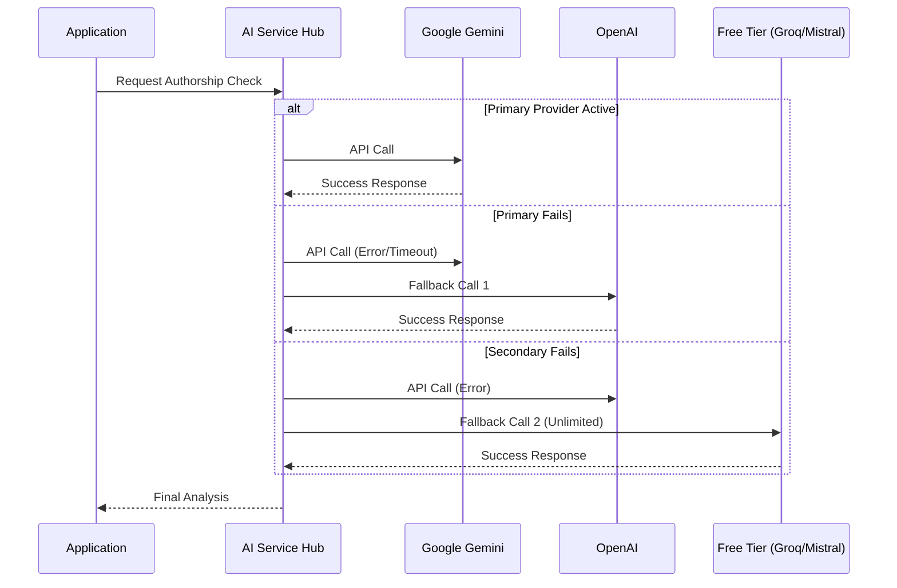

# System Architecture

## Overview

PlagiarismGuard Pro v3.2.0 uses a modern, loosely-coupled architecture designed for **privacy**, **resiliency**, and **scientific accuracy**.

```mermaid
graph TD
    User[User / Client Browser]
    
    subgraph Frontend [React Application]
        UI[App.jsx / UI Layer]
        Router[Mode Router]
        Dashboard[Results Dashboard]
    end
    
    subgraph CoreEngine [Analysis Engine]
        DocParser[Document Parser]
        Cleaner[Text Cleaner]
        Shingler[Scientific Shingler (k=5)]
        Scorer[Exact Coverage Calculator]
    end
    
    subgraph AI_Hub [Cognitive AI Hub]
        Orchestrator[AI Service Orchestrator]
        Gemini[Google Gemini]
        OpenAI[OpenAI GPT-4]
        Anthropic[Claude 3]
        LocalModels[Local/Free Models]
    end
    
    style User fill:#f9f,stroke:#333,stroke-width:2px
    style AI_Hub fill:#e1f5fe,stroke:#0277bd,stroke-width:2px
    style CoreEngine fill:#fff3e0,stroke:#f57c00,stroke-width:2px

    User -->|Uploads File| UI
    UI -->|Router| CoreEngine
    CoreEngine -->|Request Check| AI_Hub
    AI_Hub -->|Authorship Analysis| CoreEngine
    CoreEngine -->|Final Score| Dashboard
    Dashboard -->|View| User
```

## Component Architecture

### 1. The Core Analysis Pipeline (Scientific Standard)

Unlike traditional tools that use fuzzy logic, PlagiarismGuard Pro uses an **Exact Coverage** model aligned with industry standards (Turnitin/iThenticate).

```mermaid
flowchart LR
    Input[Raw Text] --> Tokenizer[Tokenizer & Normalizer]
    Tokenizer --> Shingler[Shingle Generator (k=5)]
    
    subgraph Exclusions [Exclusion Filters]
        Citations[Citation Parser]
        Common[Common Phrase Detector]
    end
    
    Tokenizer --> Citations
    Tokenizer --> Common
    
    Shingler --> Matcher{Match with Database?}
    Citations -->|Exclude Range| Matcher
    Common -->|Exclude Range| Matcher
    
    Matcher -->|Yes| MatchedSet[Unique Matched Words]
    Matcher -->|No| Ignored
    
    MatchedSet --> Calculator[coverage = (matched / total) * 100]
    Calculator --> Score[Final Similarity Index]
```

### 2. Cognitive AI Hub (Resiliency Layer)

The AI Hub manages connections to multiple LLM providers. It implements a **Fallback Strategy** to ensure the system works even if one provider is down or a key quota is exhausted.



### 3. Data Privacy & Security Model

We adhere to a **"Client-First"** security model.

*   **Local Processing**: Document parsing (PDF/DOCX) happens entirely in the browser using WebAssembly libraries (`pdfjs-dist`, `mammoth`).
*   **Ephemeral Analysis**: Text sent to AI providers is stateless. We do not store user documents on our servers.
*   **Encrypted Keys**: API keys are stored in the user's browser `localStorage` and never transmitted to our backend.

## File Structure

```
d:\plagiarism-checker-app\
├── src\
│   ├── components\     # React UI Components
│   │   ├── SettingsModal.jsx  # AI Hub Configuration
│   │   └── ResultsDashboard.jsx # Visual Reporting
│   ├── lib\            # Logic Core
│   │   ├── plagiarismAnalyzer.js # Main Orchestrator
│   │   ├── shared\analysisShared.js # Shingling Algorithms
│   │   └── llmService.js      # AI Hub & Fallbacks
│   └── App.jsx         # Main Entry Point
├── api\                # Serverless Proxies (Optional)
├── extension\          # Browser Extension Integration
└── public\             # Static Assets
```

## Technology Stack

| Layer | Technology | Reason |
|-------|------------|--------|
| **Frontend** | React 18 + Vite | High performance, component-based UI |
| **Styling** | Vanilla CSS + Variables | Lightweight, themeable without external libs |
| **Analysis** | JavaScript (ES6+) | Runs universally in browser & Node.js |
| **Parsing** | PDF.js / Mammoth | Client-side file reading |
| **AI Layer** | Multiple SDKs | Google GenAI, OpenAI, Anthropic |

---
*Architecture updated for v3.2.0 - Scientific Coverage Update*
