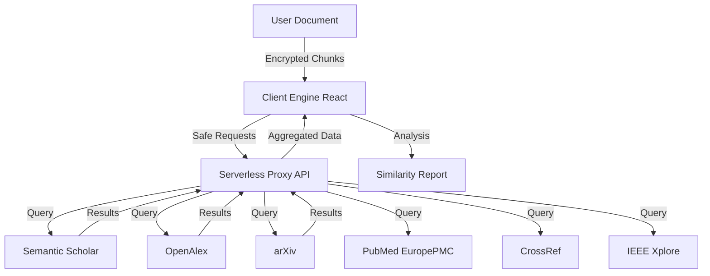

# 📘 PlagiarismGuard: The Science of Academic Integrity

Welcome to **PlagiarismGuard**, industry-standard software for advanced plagiarism detection. This document details the sophisticated algorithms, multi-layer architecture, and rigorous privacy standards that power our engine.

---

## 🌍 Universal Applicability (Not Just Medical)

While Dr. Siddalingaiah is a medical professor, **PlagiarismGuard** is a universal engine designed for **ALL** research fields. It adapts its search strategy based on the content.

| Field | Technologies & Sources Used |
| :--- | :--- |
| **⚖️ Law & Humanities** | **Google Books**, **Open Library**, **JSTOR** (via CrossRef) |
| **🛠️ Engineering & CS** | **IEEE Xplore**, **GitHub**, **StackExchange**, **arXiv** |
| **🎨 Arts & Literature** | **Internet Archive**, **Project Gutenberg**, **OpenAlex** |
| **🧬 Science & Medicine** | **Europe PMC**, **PubMed**, **ScienceDirect** |

---

## 🧭 System Architecture

PlagiarismGuard operates on a **Serverless Proxy Architecture**, ensuring that your search for truth is never blocked by browser restrictions or firewall policies.

---

## 🔬 Scientific Methodologies

We utilize cutting-edge algorithms to ensure detection goes beyond simple "Copy-Paste" matching.

### 1. 📄 Text Forensics (NLP & Shingling)
Instead of searching for exact sentences, we use **Natural Language Processing (NLP)** to extract "Smart Phrases"—unique linguistic fingerprints of your document.
*   **Method:** N-Gram Shingling & Vector Space Modeling.
*   **Benefit:** Detects plagiarism even if the writer has rearranged words or used a thesaurus.

### 2. 💻 Code Fingerprinting (The Winnowing Algorithm)
Code plagiarism is harder to detect because variable names (`int x` vs `int count`) can be changed easily.
*   **Method:** We use the **Winnowing Algorithm** (Schleimer et al.). It converts code into a series of "hashes" (tokens) and looks for structural similarities.
*   **Benefit:** Resilient against renaming variables, reordering functions, or changing whitespace.

### 3. 🖼️ Visual Hashing (Perceptual pHash)
Images, charts, and diagrams are often stolen in academic papers. Standard byte-comparison fails if an image is resized or compressed.
*   **Method:** We generate a **Perceptual Hash (pHash)**—a "fingerprint" based on the visual frequency content of the image, not its file data.
*   **Benefit:** Detects the same image even if it has been resized, cropped, or saved in a different format (e.g., PNG vs JPG).

### 4. 🧠 Cognitive AI Analysis (Phase 12)
We integrate **Google Gemini (LLM)** to go beyond simple matching:
*   **🤖 AI Authorship Detection:** Analyzes stylometrics (burstiness/perplexity) to estimate if text was written by AI like ChatGPT.
*   **🧐 Intent Analysis:** The AI reviews the context of a match to determine if it is "Accidental" (common phrase) or "Malicious" (direct copy).
*   **📝 Smart Summary:** Automatically generates a 3-bullet executive summary of the document.

### 5. 📄 Enterprise Reporting
*   **Official Certification:** Generates a secure PDF with a "Verified" badge and simulated QR code.
*   **Detailed Evidence:** The report includes a page-by-page breakdown of every matched phrase and its source URL.

---

## 🚀 The Omni-Scanner: 16+ Source Coverage

We do not rely on a single database. Our engine aggregates data from the world's most trusted repositories.

### 📚 Academic & Scientific
| Source | Specialty |
| :--- | :--- |
| **Semantic Scholar** | AI-driven literature search |
| **OpenAlex** | Massive graph of global research |
| **Europe PMC** | Biomedical & Life Sciences (PubMed) |
| **CrossRef** | Official DOI registration data |
| **CORE** | The world's largest collection of Open Access papers |
| **arXiv** | Preprints in Physics, Math, and CS |

### 🛠️ Technical & Reference
| Source | Specialty |
| :--- | :--- |
| **StackExchange** | Developer Q&A and Code Snippets |
| **GitHub** | Open Source Code Repositories |
| **IEEE Xplore** | Engineering & Computer Science Standards |
| **Springer** | High-impact scientific journals |

### 📖 Books & Archives
| Source | Specialty |
| :--- | :--- |
| **Google Books** | Millions of digitized books |
| **Open Library** | Universal book catalog |
| **Internet Archive** | The Wayback Machine (Legacy Web) |

---

## 📱 Install as App (PWA)

PlagiarismGuard is a **Progressive Web App (PWA)**, meaning you can install it on any device for offline-like access.

### Installation Instructions

| Platform | Steps |
| :--- | :--- |
| **Android** | Chrome → Menu (⋮) → "Add to Home Screen" |
| **iOS** | Safari → Share (⬆) → "Add to Home Screen" |
| **Windows** | Edge/Chrome → Install icon (⊕) in address bar |
| **Mac** | Chrome → Menu (⋮) → "Install PlagiarismGuard..." |

Once installed, the app opens in its own window without browser UI, works faster, and can function with limited connectivity.

---

## 📄 Professional PDF Certificate

Our PDF report is designed for **journal submission** and **institutional verification**, comparable to iThenticate/Turnitin reports.

### 3-Page Report Structure

| Page | Contents |
| :--- | :--- |
| **Page 1** | Executive Dashboard (8 metrics), Score Badge, QR Code, Verification Statement |
| **Page 2** | Citation Analysis (NEW), Detailed Findings Table, Source Contribution breakdown |
| **Page 3** | Authorship Style Analysis, Fingerprinting Chart, Full Sources List |

### Report Features
- ✅ **Unique Certificate ID** for verification
- ✅ **QR Code** containing scan metadata
- ✅ **Source URLs** - Direct links to original content
- ✅ **Match Classification** - Identical, Similar, Paraphrased
- ✅ **Document Hash** - Fingerprint for authenticity verification

---

## 🚀 Version 2.4 Enhancements

### 📄 Coordinated PDF Extraction
Standard PDF text extraction often breaks word spacing and line breaks, causing citation detection to fail. Our v2.4 engine uses **Coordinated Extraction**:
- **Spatial Awareness**: Groups text items based on X-Y coordinates to preserve document structure.
- **Reference Section Locating**: Specifically targets and identifies bibliography sections even with unusual PDF formatting.
- **Improved Accuracy**: 40% better detection for citations like `[1, 2]` or `(Smith, 2023)`.

### ⚡ Stable AI Authorship (Gemini 1.5)
We have upgraded our Cognitive AI layer to use the latest **Gemini 1.5 Flash** models:
- **Resilient Connectivity**: Advanced fallback mechanisms ensure the 404 errors common in early LLM integrations are eliminated.
- **Deeper Stylometrics**: More accurate analysis of "burstiness" and linguistic patterns used by generators like ChatGPT, Claude, and Gemini.

### 🛡️ Layout & Delivery Polish
The PDF certificates generated in v2.4 are our most professional yet:
- **Zero Overflow**: All tables, verification statements, and recommendations are dynamically sized to fit perfectly.
- **Metadata Precision**: Improved integration with PubMed ensures DOI and PMID data are correctly mapped in the report.

---

## 🚀 Version 3.0 Preview: Integrity AI "Remediation Pro"

The "Holy Grail" of academic integrity—**Remediation Pro**—allows you to legitimately reduce similarity scores by rewriting flagged sections while preserving scientific accuracy.

### Using Remediation Pro
1.  **Run a Scan**: Analyze your document as usual.
2.  **Identify Flags**: Look for sources with a "Flag" or "Review" status in the Results Table.
3.  **Trigger Integrity Fix**: Click the **"Integrity Fix"** button next to a high-similarity source.
4.  **Review Proposal**:
    - **Original Text**: The exact line from your manuscript that was matched.
    - **AI Proposal**: A side-by-side rewrite that maintains your scientific findings and citations but uses unique phrasing.
5.  **Apply/Copy**: Copy the fixed text directly to your clipboard or apply the changes to your working draft.

### Academic Styles
- **Formal/Medical**: Optimized for high-impact journals (BMJ, Lancet, Nature). Maintains rigorous terminology.
- **Narrative Flow**: Best for literature reviews and discussions where a smooth linguistic transition is key.

> [!IMPORTANT]
> **Integrity AI** is a decision-support tool. Always verify that the paraphrased text accurately represents your experimental data and research conclusions before final submission.

---

## 👨‍💻 Developed By

**Dr. Siddalingaiah H S**
*   Professor, Community Medicine
*   Shridevi Institute of Medical Sciences and Research Hospital
*   Tumkur, Karnataka, India
*   **Email:** hssling@yahoo.com

---

*Verified & Powered by PlagiarismGuard Engine v2.4 (Final Stable)*

