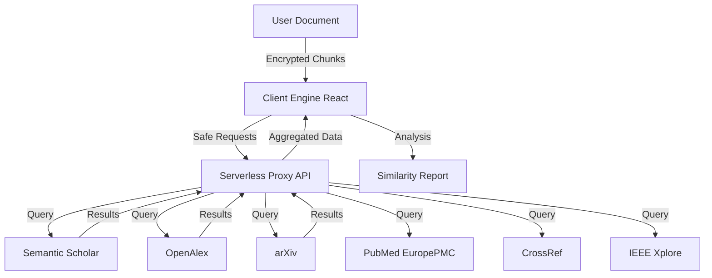

# 📘 PlagiarismGuard: The Science of Academic Integrity

Welcome to **PlagiarismGuard**, industry-standard software for advanced plagiarism detection. This document details the sophisticated algorithms, multi-layer architecture, and rigorous privacy standards that power our engine.

---

## 🌍 Universal Applicability (Not Just Medical)

While Dr. Siddalingaiah is a medical professor, **PlagiarismGuard** is a universal engine designed for **ALL** research fields. It adapts its search strategy based on the content.

| Field | Technologies & Sources Used |
| :--- | :--- |
| **⚖️ Law & Humanities** | **Google Books**, **Open Library**, **JSTOR** (via CrossRef) |
| **🛠️ Engineering & CS** | **IEEE Xplore**, **GitHub**, **StackExchange**, **arXiv** |
| **🎨 Arts & Literature** | **Internet Archive**, **Project Gutenberg**, **OpenAlex** |
| **🧬 Science & Medicine** | **Europe PMC**, **PubMed**, **ScienceDirect** |

---

## 🧭 System Architecture

PlagiarismGuard operates on a **Serverless Proxy Architecture**, ensuring that your search for truth is never blocked by browser restrictions or firewall policies.

---

## 🔬 Scientific Methodologies

We utilize cutting-edge algorithms to ensure detection goes beyond simple "Copy-Paste" matching.

### 1. 📄 Text Forensics (NLP & Shingling)
Instead of searching for exact sentences, we use **Natural Language Processing (NLP)** to extract "Smart Phrases"—unique linguistic fingerprints of your document.
*   **Method:** N-Gram Shingling & Vector Space Modeling.
*   **Benefit:** Detects plagiarism even if the writer has rearranged words or used a thesaurus.

### 2. 💻 Code Fingerprinting (The Winnowing Algorithm)
Code plagiarism is harder to detect because variable names (`int x` vs `int count`) can be changed easily.
*   **Method:** We use the **Winnowing Algorithm** (Schleimer et al.). It converts code into a series of "hashes" (tokens) and looks for structural similarities.
*   **Benefit:** Resilient against renaming variables, reordering functions, or changing whitespace.

### 3. 🖼️ Visual Hashing (Perceptual pHash)
Images, charts, and diagrams are often stolen in academic papers. Standard byte-comparison fails if an image is resized or compressed.
*   **Method:** We generate a **Perceptual Hash (pHash)**—a "fingerprint" based on the visual frequency content of the image, not its file data.
*   **Benefit:** Detects the same image even if it has been resized, cropped, or saved in a different format (e.g., PNG vs JPG).

### 4. 🧠 Cognitive AI Analysis (Phase 12)
We integrate **Google Gemini (LLM)** to go beyond simple matching:
*   **🤖 AI Authorship Detection:** Analyzes stylometrics (burstiness/perplexity) to estimate if text was written by AI like ChatGPT.
*   **🧐 Intent Analysis:** The AI reviews the context of a match to determine if it is "Accidental" (common phrase) or "Malicious" (direct copy).
*   **📝 Smart Summary:** Automatically generates a 3-bullet executive summary of the document.

### 5. 📄 Enterprise Reporting
*   **Official Certification:** Generates a secure PDF with a "Verified" badge and simulated QR code.
*   **Detailed Evidence:** The report includes a page-by-page breakdown of every matched phrase and its source URL.

---

## 🚀 The Omni-Scanner: 16+ Source Coverage

We do not rely on a single database. Our engine aggregates data from the world's most trusted repositories.

### 📚 Academic & Scientific
| Source | Specialty |
| :--- | :--- |
| **Semantic Scholar** | AI-driven literature search |
| **OpenAlex** | Massive graph of global research |
| **Europe PMC** | Biomedical & Life Sciences (PubMed) |
| **CrossRef** | Official DOI registration data |
| **CORE** | The world's largest collection of Open Access papers |
| **arXiv** | Preprints in Physics, Math, and CS |

### 🛠️ Technical & Reference
| Source | Specialty |
| :--- | :--- |
| **StackExchange** | Developer Q&A and Code Snippets |
| **GitHub** | Open Source Code Repositories |
| **IEEE Xplore** | Engineering & Computer Science Standards |
| **Springer** | High-impact scientific journals |

### 📖 Books & Archives
| Source | Specialty |
| :--- | :--- |
| **Google Books** | Millions of digitized books |
| **Open Library** | Universal book catalog |
| **Internet Archive** | The Wayback Machine (Legacy Web) |

---

## 🛡️ Privacy by Design

We believe your research belongs to you.

*   **Zero-Storage Policy:** Your documents are analyzed in **RAM** (Random Access Memory). Once you close the tab, the analysis is wiped. We **never** save your text to a database.
*   **Ephemeral Queries:** When we search external databases, we only send small snippet hashes, never your full full manuscript.
*   **Client-Side Processing:** The heavy lifting (hashing, comparison, report generation) happens right in your browser, keeping your data on your device.

---

## 👨‍💻 Developed By

**Dr. Siddalingaiah H S**
*   Professor, Community Medicine
*   Shridevi Institute of Medical Sciences and Research Hospital
*   Tumkur, Karnataka, India
*   **Email:** hssling@yahoo.com

---

*Verified & Powered by PlagiarismGuard Engine v2.0*
